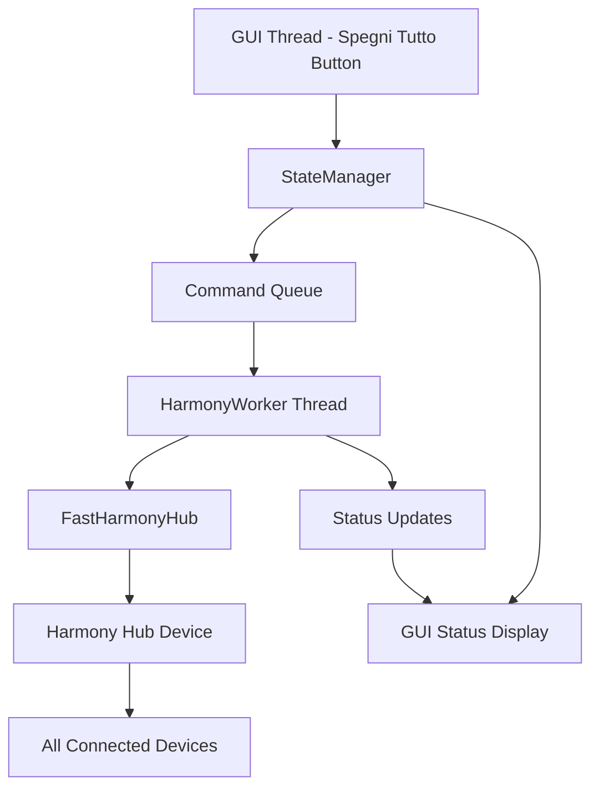

# Design Document: Spegni Tutto Button

## Overview

Il tasto "SPEGNI TUTTO" è già presente nella GUI del Harmony Hub Controller ma necessita di verifica e possibili correzioni per garantire che esegua correttamente l'attività con ID -1. Il design si concentra sull'analisi del flusso esistente e sull'implementazione di eventuali correzioni necessarie per assicurare il corretto funzionamento del comando di spegnimento globale.

## Architecture

Il sistema utilizza un'architettura multi-thread con separazione delle responsabilità:



### Flusso di Esecuzione

1. **User Click**: L'utente clicca il tasto "SPEGNI TUTTO" rosso nella GUI
2. **Command Parsing**: Il sistema parsa il comando "off" 
3. **State Management**: Il StateManager gestisce la coda e lo stato sequenziale
4. **Worker Execution**: Il HarmonyWorker esegue `start_activity_fast("-1")`
5. **Hub Communication**: FastHarmonyHub invia il comando WebSocket all'hub
6. **Device Control**: L'hub spegne tutti i dispositivi attivi
7. **Status Update**: La GUI aggiorna lo stato a "⚫ OFF"

## Components and Interfaces

### GUI Component (Existing)
```python
# Tasto già esistente in harmony_gui.py (linea ~450)
self.btn_off = self.create_btn("SPEGNI TUTTO", "off", "⏻")
self.btn_off.setFixedHeight(40)
self.btn_off.setStyleSheet(f"""
    QPushButton {{
        color: {C['danger']};  # Rosso per indicare spegnimento
    }}
""")
```

### Command Handler (Existing - da verificare)
```python
# In HarmonyWorker._handle_command() (linea ~350)
elif cmd == "off":
    # PowerOff activity is typically -1
    self.command_progress.emit(cmd, action or "", "Powering off...")
    res = await self.hub.start_activity_fast("-1")
```

### State Management Integration
```python
# Il tasto utilizza il sistema StateManager esistente
def run(self, cmd):
    parts = cmd.split(maxsplit=1)
    command = parts[0]  # "off"
    action = parts[1] if len(parts) > 1 else None  # None
    
    # Queue through StateManager for sequential processing
    command_queued = self.state_manager.queue_command(command, action)
    self.worker.queue_command(command, action)
```

## Data Models

### Command Structure
```python
@dataclass
class OffCommand:
    command: str = "off"
    action: Optional[str] = None
    activity_id: str = "-1"
    expected_result: str = "⚫ OFF"
```

### Hub Response Model
```python
@dataclass
class HubResponse:
    status: str  # "success" or "error"
    activity_id: str  # Should be "-1" after successful off command
    error_message: Optional[str] = None
```

## Correctness Properties

*A property is a characteristic or behavior that should hold true across all valid executions of a system-essentially, a formal statement about what the system should do. Properties serve as the bridge between human-readable specifications and machine-verifiable correctness guarantees.*

Basandomi sull'analisi dei criteri di accettazione, definisco le seguenti proprietà di correttezza:

### Property 1: Button Click Command Transmission
*For any* click event on the "SPEGNI TUTTO" button, the GUI system should send the command "off" to the HarmonyWorker
**Validates: Requirements 1.1**

### Property 2: Off Command Activity Execution  
*For any* "off" command received by the HarmonyWorker, the system should execute start_activity_fast with activity ID "-1"
**Validates: Requirements 1.2**

### Property 3: Successful Completion Status Update
*For any* successfully completed "off" command, the GUI system should update the status display to show "⚫ OFF"
**Validates: Requirements 1.4**

### Property 4: Button State Management When Off
*For any* system state where the current activity is "OFF", the "SPEGNI TUTTO" button should be disabled
**Validates: Requirements 1.5**

### Property 5: Error Display on Command Failure
*For any* failed "off" command, the GUI system should display an error message through the StateManager
**Validates: Requirements 2.1**

### Property 6: Network Error Retry Mechanism
*For any* network error during "off" command execution, the HarmonyWorker should attempt automatic reconnection using the existing retry mechanism
**Validates: Requirements 2.2**

### Property 7: Timeout Error Notification
*For any* "off" command that times out, the GUI system should inform the user of the uncertain state
**Validates: Requirements 2.3**

### Property 8: Immediate Visual Feedback
*For any* press of the "SPEGNI TUTTO" button, the GUI system should provide immediate visual feedback through the StateManager
**Validates: Requirements 2.4**

### Property 9: StateManager Queue Integration
*For any* "off" command, the system should route it through the StateManager command queue for sequential processing
**Validates: Requirements 3.1**

### Property 10: Consistent Timeout and Retry Settings
*For any* "off" command execution, the timeout and retry settings should match those used by other activity commands in the HarmonyWorker
**Validates: Requirements 3.2**

### Property 11: Button Disabled During Activity Execution
*For any* period when other activities are being executed, the "SPEGNI TUTTO" button should be disabled to prevent conflicts
**Validates: Requirements 3.5**

## Error Handling

Il sistema gestisce diversi tipi di errori attraverso meccanismi esistenti:

### Network Errors
- **Retry Mechanism**: Il HarmonyWorker utilizza il decorator `@network_retry` con backoff esponenziale
- **Reconnection**: Connessione WebSocket automaticamente ristabilita in caso di disconnessione
- **User Feedback**: StateManager mostra messaggi di errore di rete appropriati

### Timeout Errors
- **Command Timeout**: Timeout di 3 secondi per il comando start_activity_fast
- **Status Uncertainty**: L'utente viene informato se il comando non riceve risposta
- **Recovery**: Il sistema tenta di recuperare lo stato reale dopo timeout

### State Management Errors
- **Sequential Processing**: StateManager previene conflitti tra comandi concorrenti
- **Button State**: I tasti vengono disabilitati durante l'esecuzione per prevenire doppi click
- **Error Recovery**: Meccanismo di recovery automatico per ripristinare lo stato normale

### Hub Communication Errors
- **WebSocket Errors**: Gestiti dal FastHarmonyHub con riconnessione automatica
- **Invalid Responses**: Filtrati e gestiti con messaggi di errore appropriati
- **Connection Loss**: Retry automatico con backoff esponenziale

## Testing Strategy

Il testing utilizza un approccio duale con unit test e property-based testing:

### Unit Testing
- **Specific Examples**: Test di scenari specifici come click del tasto, stati di errore
- **Edge Cases**: Test di condizioni limite come sistema già spento, errori di rete
- **Integration Points**: Test dell'integrazione tra GUI, StateManager e HarmonyWorker
- **Mock Objects**: Utilizzo di mock per simulare hub responses e network errors

### Property-Based Testing
- **Framework**: Utilizzo di pytest con hypothesis per property-based testing
- **Test Configuration**: Minimo 100 iterazioni per test per copertura completa
- **Input Generation**: Generatori intelligenti per stati GUI, comandi e risposte hub
- **Property Validation**: Ogni proprietà implementata come test separato

### Test Implementation Guidelines
- **Test Isolation**: Ogni test deve essere indipendente e ripetibile
- **State Reset**: Reset dello stato GUI e StateManager tra test
- **Async Testing**: Utilizzo di pytest-asyncio per testare componenti asincroni
- **Coverage**: Copertura completa di tutti i path di esecuzione del comando "off"

### Property Test Tags
Ogni property test deve essere taggato con:
```python
# Feature: spegni-tutto-button, Property 1: Button Click Command Transmission
```

Questo formato permette la tracciabilità tra proprietà di design e implementazione test.

<function_calls>
<invoke name="prework">
<parameter name="featureName">spegni-tutto-button