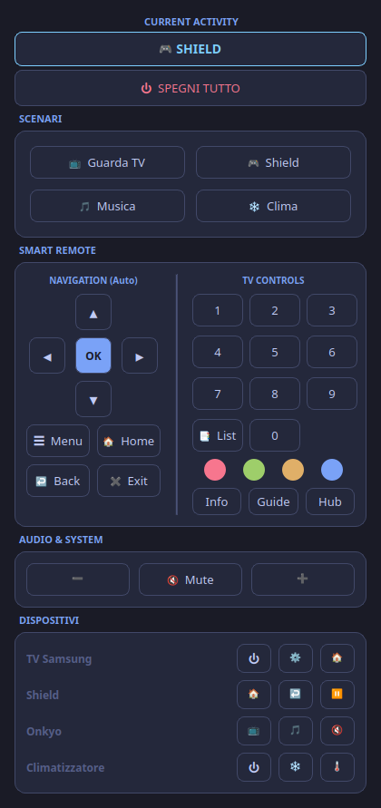

# Harmony Hub Controller

Local CLI and desktop remote for the Logitech Harmony Hub. No cloud, no polling: it talks to the Hub over its LAN WebSocket API the same way the official mobile app does.


<p align="center">
  
</p>

## Features

- **Instant state** – the Hub pushes every change (also from the physical remote); the GUI reflects it in real time, including "starting…" and "stopping…" transitions.
- **Fast commands** – device keys are sent as press/release like a real remote (~20 ms), activities wait for the Hub's real completion event.
- **Push-and-hold** – keep volume, D-pad, Back and Exit pressed to repeat, exactly like on the remote.
- **Smart remote** – navigation keys follow the running activity (TV, media player, receiver).
- **Auto-discovery** – finds the Hub on the LAN and generates the configuration from it.
- **CLI + GUI** – script it from the shell or use the Qt6 desktop app, with KDE menu entry and shell aliases.

Works with any hub-based Harmony (Elite, Companion, Smart Control, Ultimate Home/Pro, standalone Hub). Logitech has discontinued the cloud services, but the local API keeps working.

## Installation

Requires Python 3.10+ on Linux.

```bash
git clone https://github.com/rylos/harmony.git
cd harmony
python3 -m venv harmony_env
source harmony_env/bin/activate
pip install -r requirements.txt
```

## Configuration

1. Find your Hub (works without any configuration):

   ```bash
   ./harmony.py find-hub
   # ✅ Sala  ip=192.168.1.101  remoteId=8084741  fw=4.15.600 ...
   ```

2. Create `config.py` from the template and set `HUB_IP` and `REMOTE_ID`:

   ```bash
   cp config.sample.py config.py
   ```

3. Let the Hub fill in activities, devices and commands:

   ```bash
   ./harmony.py discover        # review what the Hub reports
   ./harmony.py export-config   # rewrite config.py with your activities and devices
   ```

`config.py` is git-ignored. Edit the aliases in it to taste (`tv`, `shield`, `onkyo`…): they become the CLI commands and GUI buttons.

## Usage

### GUI

```bash
./start_harmony_gui.sh
```

Optional: `./install_to_menu.sh` adds a KDE/XDG menu entry, `./setup_aliases.sh` creates shell aliases.

### CLI

| Command | What it does |
|---|---|
| `./harmony.py status` | Current activity (⚫ OFF / 🟢 Shield / ⏳ Starting: TV) |
| `./harmony.py tv` | Start the activity aliased `tv` and wait for the Hub to finish (`--no-wait` to return at once) |
| `./harmony.py off` | Power everything off |
| `./harmony.py onkyo VolumeUp` | Send a device command (`<device alias> <command>`) |
| `./harmony.py onkyo VolumeUp --hold 2` | Keep a key pressed for 2 s |
| `./harmony.py vol+` / `vol-` / `mute` | Quick audio commands |
| `./harmony.py sleep 30` / `sleep off` | Sleep timer |
| `./harmony.py channel 5` | Change channel in the current activity |
| `./harmony.py list` | All configured activities, devices and commands |

Diagnostics:

| Command | What it does |
|---|---|
| `./harmony.py find-hub` | Discover Hubs on the LAN |
| `./harmony.py ping` | Reachability check |
| `./harmony.py digest` | Raw Hub state (JSON) |
| `./harmony.py events` | Print push events live (`--timeout 60`) |
| `./harmony.py sysinfo` | Firmware, account and discovery info |
| `./harmony.py show-hub` / `show-activity <id>` / `show-device <id>` | Details from the Hub configuration |
| `./harmony.py benchmark` | Round-trip timings |

Add `-v` for verbose output.

## How it works

The Hub exposes a JSON-over-WebSocket API on port 8088. The client was modelled on the transport of the official Android app:

- one reader task: replies carry an `id`, push events don't;
- state comes from `connect.statedigest?get` and `connect.stateDigest?notify` events, not from polling;
- key presses are `holdAction` press/hold/release messages sharing one id and a connection-relative timestamp;
- keepalive with a WebSocket PING every 45 s, automatic reconnection.

Full protocol notes, including what was verified on real hardware, are in [`HARMONY_APK_PROTOCOL_ANALYSIS.md`](HARMONY_APK_PROTOCOL_ANALYSIS.md).

## Troubleshooting

**`config.py` not found** – run `./harmony.py find-hub`, copy `config.sample.py` to `config.py`, then `export-config`.

**`find-hub` finds nothing** – the PC must be on the same LAN as the Hub (no VLAN/guest network), UDP broadcast to port 5224 and an incoming TCP connection on port 5446 must be allowed by the firewall. As a fallback, read the Hub IP from your router and put it in `config.py` by hand.

**"Hub non raggiungibile" in the GUI** – the app retries every 5 s. Check `./harmony.py ping`; a Hub on 2.4 GHz Wi-Fi with heavy packet loss shows exactly this symptom.

**Command has no effect but no error** – the Hub does not acknowledge valid IR commands. Verify the command name with `./harmony.py show-device <id>`; unknown names are reported (`Command not found`).

## License

GPL-2.0. See [LICENSE](LICENSE).
